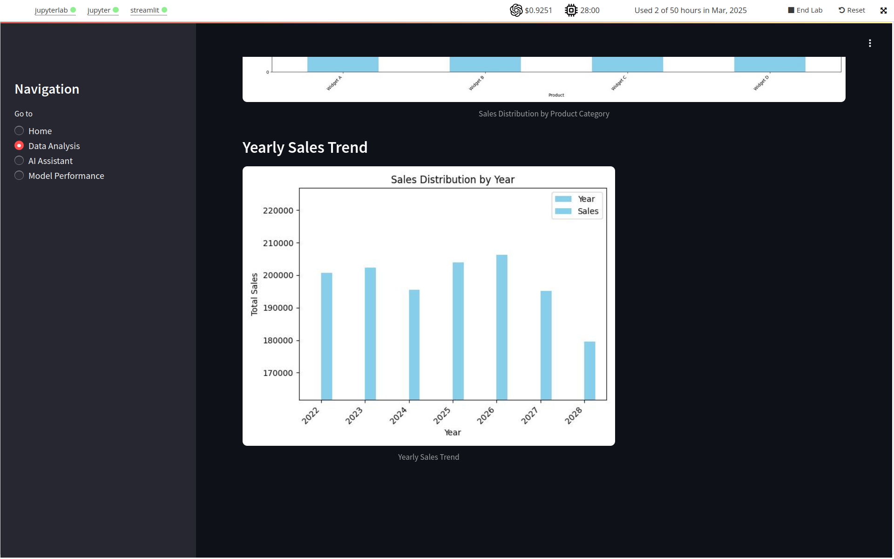

# AI-powered Business Intelligence Assistant for Organizations

This project was developed in the context of the [Applied Generative AI Specialization](https://bootcamp-sl.discover.online.purdue.edu/applied-artificial-intelligence-course#what-topics-are-covered-in-the-purdue-simplilearn-applied-generative-ai-course) as a capstone project.

Its main goal is the development of AI agent able to provide insights and recommendations based on the analysis of sales data from the organization along with additional private data and external sources.

This has been mainly achieved by using Large language models (LLMs) coupled with prompt-engineering and retrieval-augmented generation (RAG) trough LangChain. I have developed several AI tools dedicated to the different tasks including data analysis, retrieval of relevant documents related to sales (FAISS vector database), Wikipedia searches and plotting of trends. The agent is able to used them depending on the request. This project also includes the evaluation and monitoring of the agent. It includes an option to assess how correct are the answers of the agent and monitor its execution time. A jupyter notebook ([insightforge_app_v1.ipynb](./scripts/insightforge_app_v1.ipynb)) shows the main scripts along with detailed annotations. In addition, the [data](./data/) folder includes the different files generated during the execution of the notebook.

All of this has been implemented in a app generated with Streamlit. It allows the user to explore the different functionalities developed. This app can be deployed using the python script [insightforge_app.py](./scripts/insightforge_app.py) (`streamlit run insightforge_app.py`), provided that Streamlit is installed, there is available sales data in the expected format along with PDFs for RAG (see [insightforge_app_v1.ipynb](./scripts/insightforge_app_v1.ipynb) for further details). Below you can see some screenshots of the application:

Home page:

Data Analysis: Sales across products and years

AI Assistant: Standard vs RAG (use internal data from sales and marketing + external data from Wikipedia)

Model performance: Evaluation of the responses of the assistant and monitoring of execution time

